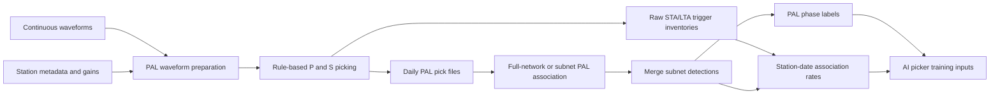

# Run PAL

Amplitude QC uses matching three-component time windows. If a short ObsPy
slice drops a component or a peak/tail window is empty, the affected QC ratio
is written as `nan` and that check is bypassed. The pick is retained unless
another available QC check fails; trigger counts and time ownership are unchanged.
Completed days remain resumable after a failed run.

Magnitude values may be negative. Event merging retains every finite magnitude;
an unavailable magnitude is written as `nan`, not -1. Exclude unavailable values
from magnitude statistics and training labels. Older outputs affected by the
negative-magnitude merge bug require recalculation from amplitudes and station
geometry; a historical -1 header value alone is ambiguous.

This workflow is synchronized with `AI-PAL/1_run_pal` and uses the same
`PAL_src` output contract. For identical data and configuration, both produce
the same scientific pick, trigger-count, association, catalog, and phase file
formats; only configured roots and execution metadata differ.

Executable rule-based PAL workflows. Source modules are in `../PAL_src/`.

- `run_pal_local/`: workstation download, daily picking, and association examples.
- `run_pal_aws/`: numbered SageMaker submitters plus fixed processing-job
  entry points and monitors for picking and association.

Set `PALM_ROOT` in each copied AWS submitter to the installed source package
(default `~/shared/software/PALM`). The AWS section below documents
SageMaker paths and job controls. Optional legacy PAL location examples are under
`run_pal_local/optional_location/`; the centralized location workflow is
`../3_location/`.

The packaged launchers default to `CASE_CODE = "eg"`, where `eg` means "example".

## Workflow Overview



The picking and association launchers execute sequential scientific stages. The
remaining sections describe waveform boundaries, configuration, and execution.

## Waveform Edges

### Association overlap and ownership

PAL configs explicitly set `association_buffer_sec = 30.0`, separately from
`data_buffer_sec = 60.0`. For nominal day D, let L = D - 60 s and
R = D + 1 day - 60 s. Buffered association loads neighboring pick files and
selects estimated station origin times in [L - 30 s, R + 30 s).
Final events belong to [L, R) by event origin time, not by P arrival time.
Raw overlapping detections are merged across neighboring days/subnets before
the canonical origin-time cut; this groups boundary duplicates with slightly
different estimated origins.

Finish local picking (including halo days) before starting
association. Local picking divides the requested interval (including halo days)
into at most `NUM_WORKERS` contiguous whole-day blocks. Each spawned process
handles its days and stations sequentially, retaining rolling tails within its
block and reading predecessor context directly at block starts/resume gaps.
Blocks write disjoint daily outputs and require no inter-worker waveform
exchange. The top-level `threads_per_worker` setting controls native numerical
thread pools per process (example default: 2, matching AWS). It is not a station
thread count and does not make every filtering operation multithreaded.
Benchmark 1 versus 2 or more on representative days; avoid oversubscribing the
available CPUs with the product of processes and native threads.
Each block has a `pick_<block-start>-<block-end>.log`; parent progress aggregates
completed/skipped days and identifies the worker of the latest station update.
Worker failures stop the run and report the relevant log; completed outputs
remain resumable. Config factories must be importable (as in the examples),
and executable scripts must use their existing `__main__` guard.
Association
divides the dates into at most num_workers contiguous blocks. Each worker
processes all subnets for its current day, sharing one full buffered pick array;
each subnet receives a station-filtered copy. A three-day parsed-pick cache
evicts older entries as the block advances. Fully resumed dates require no
pick reads. Only block-boundary halos and the later association-rate pass can
reread daily picks; separate subnets no longer cause extra reads. No full-study
pick inventory is retained in RAM. Subnet association is sequential within a
worker; blocks run in parallel, so a very short interval may use fewer workers.

Changing association buffer mode or seconds invalidates association resume
statuses; old statuses without this policy are recomputed. Picks are unchanged.
Legacy configs without the explicit setting still use the 2*s_win fallback.
The AI ensemble workflow's separate buffer defaults are not changed here.

### Waveform context

PAL uses the same rolling raw-tail strategy as AI-PAL. With the default
`data_buffer_sec = 60`, the run seeds its first date from the preceding day's
final 120 s, then caches the current day's final 120 s for the next date. Each
date therefore preprocesses 24 hours plus 120 s while normally opening only
the current daily input.

Dates are processed sequentially. Within each date, `num_workers` stations are
read and picked concurrently; all station results are collected before the
cache advances to the following date. Pick-file writes remain centralized.

The file named for nominal date `D` owns P arrivals in
`[D - data_buffer_sec, D + 1 day - data_buffer_sec)`. Association and daily
event filtering use the same shifted bounds. Set `data_buffer_sec = 0` to
retain strict UTC-day ownership without edge context.
## Local Workflow

Local picking reports concise console progress every 30 seconds and after each
completed/skipped day: date, collected station results, completed/skipped days
(including requested halo days), and elapsed time. Detailed station output
stays in the line-buffered pick log. During startup the heartbeat reports
initialization/previous-day context loading. A long-running station can leave
the collected count unchanged while the heartbeat continues. Exceptions appear
on the console and retain their traceback in the log.

Edit the clearly marked user-settings blocks in `run_pal_local/` and run
picking, then association:

```bash
python 1_run_pal_pick_eg.py
python 2_run_pal_assoc_eg.py
```

Station metadata preparation lives in `../preprocess/`. Step 0.2 publishes all
candidate `NET.STA.BAND.LOC` gain epochs with their actual operational periods.
Local examples default to `input/example_pal_format4.sta`. Selection is dynamic
per station-day: `station_selection_order = "channel_first"` (default) or
`"location_first"`, using the configured channel and location priority lists.
Detailed gains are applied to the selected original component before merging.
Location comes from the MiniSEED header, even when the filename omits it.
Local picking prefers an exact band/location/time match, then an active gain
from another location of the same band, then the nearest same-band gain epoch
(preferring the matching location on ties). It does not borrow between bands.
If no compatible gain exists, it uses 1 and retains uncalibrated counts so a
missing gain alone does not discard the waveform. Fallbacks are warned in the
pick log; amplitudes, amplitude-based quality checks, and magnitudes may be
unreliable. Legacy unqualified rows still apply to all bands.
AWS/shared calibration remains strict unless explicitly opted into fallback.
Existing pick outputs are not automatically invalidated: reprocess affected
days and their downstream association outputs after installing this change.
See [station formats](../STATION_FORMATS.md) for compatibility and migration.

`1_run_pal_pick_eg.py` writes picks and sidecars; association reads those
files without rereading waveforms. Keep both launchers' date ranges and pick
directories aligned. The association launcher accepts either a single `full`
station set or subnet keys matching `subnet_assoc_params` in the selected case
config. Local launchers use buffered association; picking includes one extra
nominal day before and after the requested interval.

On resume with overwrite disabled, completed days are checked using their pick
and sidecar files without scanning or reading waveforms. Immediately before a
day needing picking, its previous-day tail is loaded if no consecutive-day
cache is available. An all-complete run does not load waveform context.

Trigger candidates and accepted picks both belong to the shifted daily interval
by refined P time (`tp`), not the initial STA/LTA crossing time. Candidates are
counted before QC, including those subsequently rejected. This keeps accepted
counts bounded by trigger counts even when P refinement crosses a day boundary.

Picking writes one `*.trigger_counts.csv` sidecar per day. Its station counts
record distinct STA/LTA trigger candidates before amplitude-ratio and related
waveform QC. Dominant frequency is not calculated or used as PAL QC.
Association statistics use pre-QC trigger counts.

```text
association_ratio = num_associated_picks / num_picks
num_picks = pre-QC STA/LTA triggers
num_unassociated_picks = num_picks - num_associated_picks
```

This retains station-days whose triggers all fail QC with association ratio
zero. Separated association requires trigger-count and ownership sidecars
created by the current picker. Legacy buffered `.pick` files without ownership
metadata are regenerated once; legacy files remain resumable when
`data_buffer_sec = 0`.

The S picker keeps the PCA amplitude-peak anchor. S STA/LTA first searches from
the earlier of the PCA interval end and half the P-to-S-peak interval through
that peak. Its input prepends the S-LTA window and appends the S-STA window so
the characteristic function is defined over the complete target interval.
The STA/LTA peak sets the earliest S boundary; long kurtosis is calculated only
from there through the S-amplitude peak, and short kurtosis is confined by the
resulting bounds. Rolling kurtosis uses cumulative moments rather than
recalculating every overlapping window.
## AWS Workflow

The `run_pal_aws/` workflow runs PAL directly against daily miniSEED objects
in `s3://scedc-pds/continuous_waveforms`. It does not create a local waveform
archive.

The two numbered root scripts are the complete user-facing workflow:

```text
1_run_pal_pick_aws_eg.py
2_run_pal_assoc_aws_eg.py
config_aws_eg.py
input/
processing_job/
```

All case, date, I/O, retry, parallelism, and SageMaker resource settings are
grouped at the beginning of the numbered scripts. The packaged example uses
`CASE_CODE = "eg"`; copied case workflows should rename the scripts and config
consistently.

`processing_job/` contains fixed implementation files:

```text
job_common.py
monitor_pick_job.py
monitor_assoc_job.py
processing_entry_pick.py
processing_entry_assoc.py
requirements.txt
```

Users normally edit only the numbered root scripts and model parameters in
`config_aws_<CASE_CODE>.py`. The container requirements file is staged and
installed automatically. No separate root requirements file or `PAL_DIR`
environment variable is needed.

### Picking Job

In `1_run_pal_pick_aws_<CASE_CODE>.py`, set at least:

```python
PALM_ROOT = Path("~/shared/software/PALM").expanduser()
CASE_CODE = "eg"
station_file = "station_scedc_aws_selected_20200101_20260701_pal.csv"
time_range = "20200101-20210101"
study_year = 2020

num_workers = 16
overwrite = False
retry_failed_dates = False
instance_type = "ml.c5.9xlarge"
threads_per_worker = 2
```

`time_range` uses an exclusive end date and must match the full `study_year`.
Station intervals are half-open (`t0 <= date < t1`).

Submit and monitor from `run_pal_aws/`:

```bash
AWS_DEFAULT_REGION=us-west-2 python 1_run_pal_pick_aws_eg.py
python processing_job/monitor_pick_job.py
```

The submitter stages its runtime JSON, config, station file, and required
`PAL_src` modules. Existing output is restored when
`resume_existing_output = True`; completed daily status files are then skipped
according to the runner settings. AWS dates run sequentially, while
`num_workers` controls concurrent station processing within the current date.
This keeps one rolling preceding-day tail cache and avoids repeated neighboring
day reads.

Daily outputs are stored under the default SageMaker bucket:

```text
sagemaker/scsn-pal/results/<CASE_CODE>-pick-<YEAR>/output/<CASE_CODE>/
```

### Association Job

In `2_run_pal_assoc_aws_<CASE_CODE>.py`, set the subnet station mapping,
`time_range`, `study_year`, worker count, instance settings, and pick job
codes. Subnet keys must match `subnet_assoc_params` in the selected case config.

The primary pick prefix must contain every target day. Set
`association_buffer_enabled = False` for independent-day training-label
association; in that mode `boundary_pick_objects` should remain empty. Buffered
association remains available for workflows that require cross-midnight event
continuity, where optional boundary objects provide the adjacent picks. Submit
only after the required picking outputs exist:

```bash
AWS_DEFAULT_REGION=us-west-2 python 2_run_pal_assoc_aws_eg.py
python processing_job/monitor_assoc_job.py
```

The submitter verifies both each daily `.pick` file and its matching
`*.trigger_counts.csv` inventory before creating the association job.

With independent-day association, every subnet reads only the target day's
picks and canonical merging uses only that day's subnet outputs. With buffered
association enabled, the expanded interval and cross-day duplicate merging are
retained.

Association output is stored under:

```text
sagemaker/scsn-pal/results/<CASE_CODE>-assoc-<YEAR>/output/assoc/
```

It includes daily subnet and merged catalogs/phases, event-group records,
association-rate CSVs, and resumable status files. The association monitor
aggregates daily pick, associated-pick, and event counts by month.

### Source Components

The submitters stage the current implementations from `PALM_ROOT/PAL_src`,
including AWS waveform access, picking and association runners, PAL models,
rolling waveform context, phase merging, and picker-ensemble metadata support.
Station files remain under `run_pal_aws/input/`.
### Waveform rules

For each date, the pipeline chooses the available band/location using the same
configurable priorities as local PAL. Station metadata is keyed by `NET.STA`;
detailed inventory gains match the actual selected band/location and sample
time. Three components are ordered as E/N/Z. For one-component data, that component is copied three times. For
two-component data, Z is copied three times when present; otherwise the first
horizontal component is copied three times.

Channels whose SEED instrument code is `N`, such as `HN`, are gain-corrected as
acceleration and integrated once to velocity before PAL's normal 1-20 Hz
preprocessing. Velocity channels are gain-corrected without integration.

## AWS Example Inputs

Files under `run_pal_aws/input/` provide the full SCEDC picking station list and six subnet station lists used by the example launchers. Replace them with case-specific station epochs before running another network or study period.
